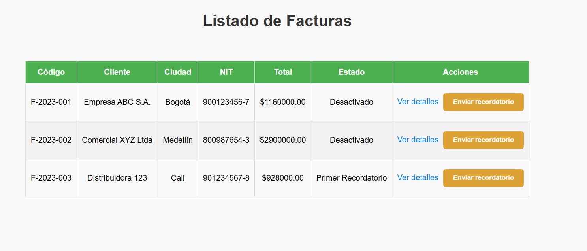
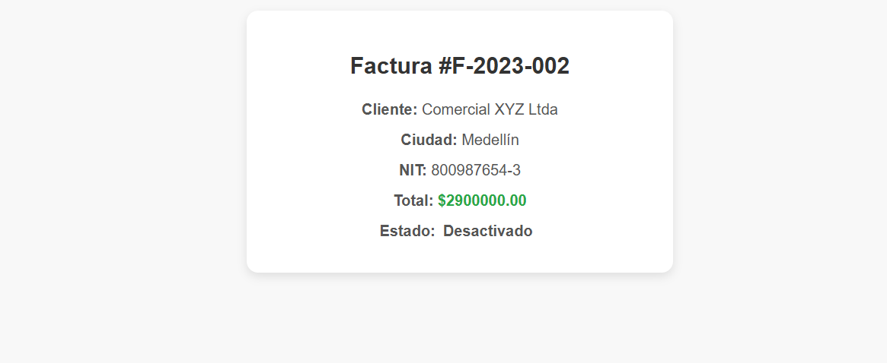
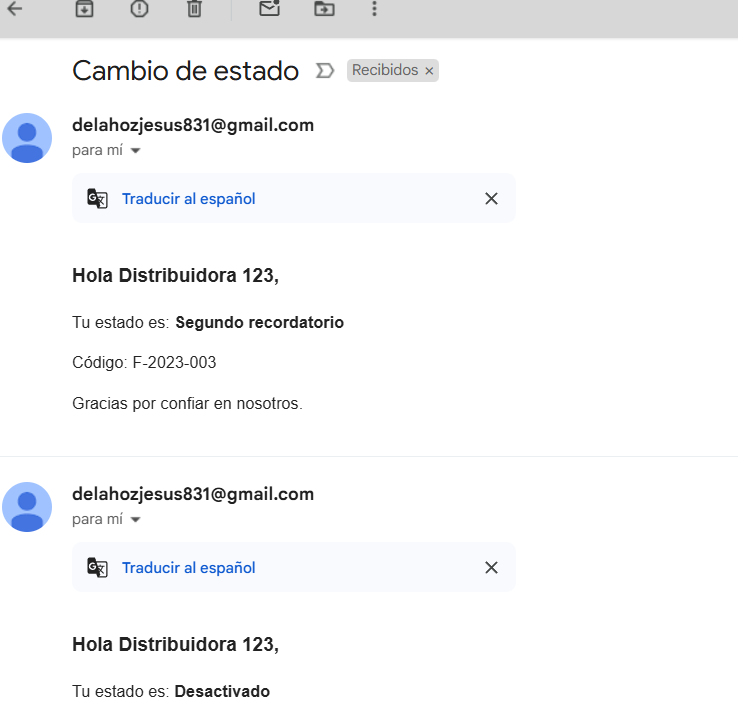

# Aplicación de Facturas

Esta aplicación permite gestionar facturas a través de una API desarrollada con .NET 8 y un frontend construido con React, TypeScript y Vite. Utiliza MongoDB como base de datos, el objetivo es enviar un correo electrónico a los clientes, cambiando el estado de su factura.

En este repositorio hay dos proyectos:

**Backend:** Hecho en .net 8; carpeta **Monolegal**

**Frontend:** React con typescript; carpeta **MonolegalFront**


## Requisitos previos

- [.NET 8 SDK](https://dotnet.microsoft.com/download/dotnet/8.0)
- [Node.js](https://nodejs.org/) (20.12.1)
- [MongoDB](https://www.mongodb.com/try/download/community)

## Configuración

### Base de datos

1. Instala y ejecuta MongoDB en tu máquina local.
2. **Importante**: Antes de ejecutar la aplicación, es necesario crear la base de datos.
Asegurate que en tu archivo appsettings esté la siguiente configuración correspondiente a tu base de datos:

```json
"MongoDbSettings": {
  "ConnectionString": "mongodb://localhost:27017",
  "DatabaseName": "InvoicesDb"
}
```

### Backend (.NET 8)

1. Si presenta problemas recuerde restaurar los paquetes NuGet
2. Al iniciar la aplicación de .net, podrá visualizar en la vista que provee swagger un servicio que se llama **agregar-datos**, este endpoint hace un llamado a un servicio de facturas que crea tres facturas.

3. #### Importante, Edite los correos electronicos asociados a cada factura, en Monolegal.Core/Services/FacturaService.cs, en la funcion InicializarDatosAsync; podrá encontrar la creación de los clientes, modifique los correos para que pueda recibir los mensajes enviados.


### Frontend (React + TypeScript + Vite)

1. Navega hasta la carpeta del proyecto frontend.
2. Instala las dependencias:

```bash
npm install
```

3. Inicia el servidor de desarrollo:

```bash
npm run dev
```

## Imágenes

### Interfaz de usuario


*Pantalla principal con listado de facturas*


*Detalle de una factura*

### Correos electrónicos


*Ejemplo de correo con detalles de factura*
